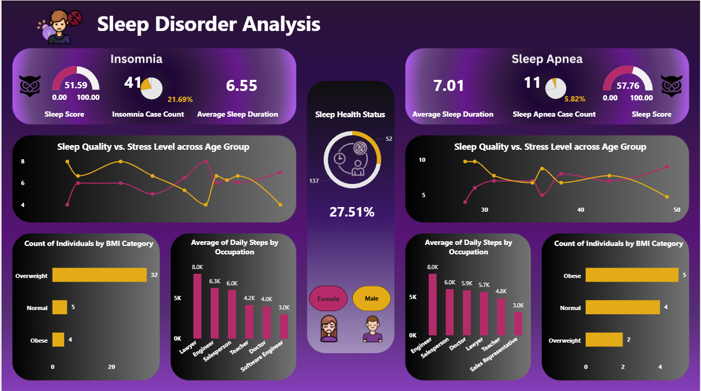

Sleep-Disorder-Analysis

## 📌 Project Overview
This interactive **Power BI Dashboard** analyzes how daily lifestyle habits, workplace environments, and health indicators impact sleep quality and trigger sleep disorders such as **Insomnia** and **Sleep Apnea**. 

The goal of this analysis is to translate complex health metrics—including **Stress Levels**, **Sleep Duration**, **BMI Categories**, and **Occupational Demands**—into actionable visual insights.

## 📸 Dashboard Preview

## 🛠️ Tools & Technologies Used
- Business Intelligence & Visualization: Microsoft Power BI
- Data Transformation & Modeling: Power Query
- UI/UX Design: Custom Dark-Themed Executive Layout

## 🔑 Key Insights & Features
- Disorder Profiling:Dedicated metrics and visual tracking for **Insomnia** vs. **Sleep Apnea** cases.
- Stress vs. Sleep Quality: Line chart trends illustrate the strong inverse relationship between high stress levels and sleep quality across different age groups.
- Occupational Patterns: Daily step counts and sleep duration comparisons across professional roles (e.g., Nurses, Engineers, Doctors, Salespersons).
- Physical Health Indicators:Categorized BMI analysis (Normal, Overweight, Obese) to identify physical risk factors associated with sleep disorders.
